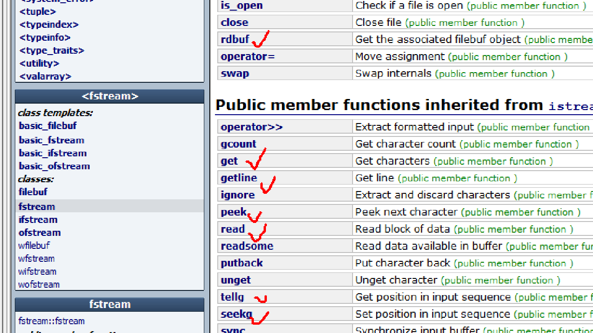

# C++04

  * 1 函数重载

  ```
  //函数重载：
  // 1. C++中允许定义同名的函数，但是必须满足一定条件：
  //    (1)参数列表不同：类型不同, 参数个数不同,顺序不同
  //    (2)返回类型不做考虑：无法重载仅按返回类型区分的函数
  //    (3)调用约定不做考虑：
  //    (4)作用域相同：

  //extern "C" {
  //
  //    int GetMax(int a, int b);
  //    //xxxx
  //}

  // 1. 根据函数名找对应的函数，作为候选函数。
  //    1.1如果候选函数个数为0，则报未定义错误（找不到标识符）
  // 2. 候选函数个数 > 0, 从候选中找匹配的函数（完全匹配，可以转换的匹配（char <-> int, float <->double float <-> int等））
  //    2.1 如果匹配的函数个数 == 0， 则错误(隐式转换失败)
  //    2.2 如果匹配的函数个数 > 0，找最佳匹配。
  // 3. 最佳匹配的个数 = 1, 就会调用该函数
  //    最佳匹配的个数 > 1，就会报二义性
  ```

  * 2 面向对象
  对象 = 数据（数据类型） + 行为（函数）
  ```
  struct tagStudent{
    int nGender;
    char szName[256];
  };

  int GetStudentGender(struct tagStudent stu){

    return stu.nGender;
  }

C++:
  冰箱{
    //数据
    品牌，
    价格，
    类型，

    //行为
    存储食物(食物);
  };

  洗衣机{
    //数据
    品牌，
    价格，

    //行为
    洗衣服(衣服);

  };

  滚筒洗衣机{

    //行为
    洗衣服(衣服);
  }

  波轮洗衣机{

    //行为
    洗衣服(衣服);
  }

  冰箱 西门子;
  西门子.存储食物(葡萄);

  滚筒洗衣机 小天鹅;
  小天鹅.洗衣服(上衣);

  波轮洗衣机 海尔;
  海尔.洗衣服(上衣);

C语言：
  存食物（西门子， 葡萄）；
  洗衣服（小天鹅， 上衣）；


  ```

cin

