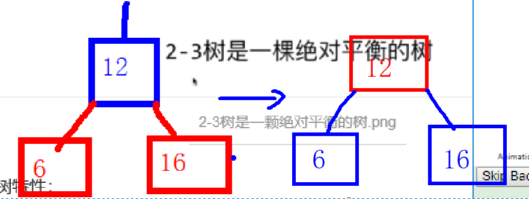

# 从2-3树到红黑树

1. 插入的情况分析
  * 2-结点插入
    - 比2结点小

      不需要旋转
    - 比2结点大
    - 新增的结点变成了红色的右链接，根据定义需要转变为红色的左链接，此时需要左单旋。
    

  * 3-结点插入
    （1）三结点的插入有3种情况：左，中，右，最后统一成一种，中间是黑色，左右是红色。
    （2）可以将中间变成红色，左右变成黑色，即表示中间结点与其父亲结合。
    
    （3）此时，父节点有两种可能，一种是二结点，则不用改变。另一种是三结点，则三结点变成了4结点，接下来开始迭代第一步。
    （4）最后到根节点时，因为根节点规定是黑色的，所以肯定是2结点，所以根变成了3结点，接下来只需要将3结点表示为红黑树中的左链接即可。

  假设这个三结点是 ： A  B
   其中三种情况的转换：
    （1）插入的数据比A小
    那么插完之后是一个连续的两个红色的左链接，需要通过右单旋转变为左右都是红色的链接。
    
    接下来就是改变左右红色链接为黑色，自己变成红色（表示四结点往上提的操作）。
    （2）插入的数据比B大
    这种情况就是直接改颜色，红变黑，黑变红（表示往上提）
    
    （3）插入的数据比A大，比B小
    这时默认插入到A的右边，此时需要先做左单旋，再做右单旋，此时变成了左右红链接的情形，再直接改颜色，红变黑，黑变红（表示往上提）。
    

    所以总结起来，有3种情况：
    情况1：
       出现了红色的右链接，则需要左单旋。
    情况2：
       出现了两个连续的红色左链接，则需要右单旋
    情形3：
      左右均是红色的链接，则只需颜色取反即可。
